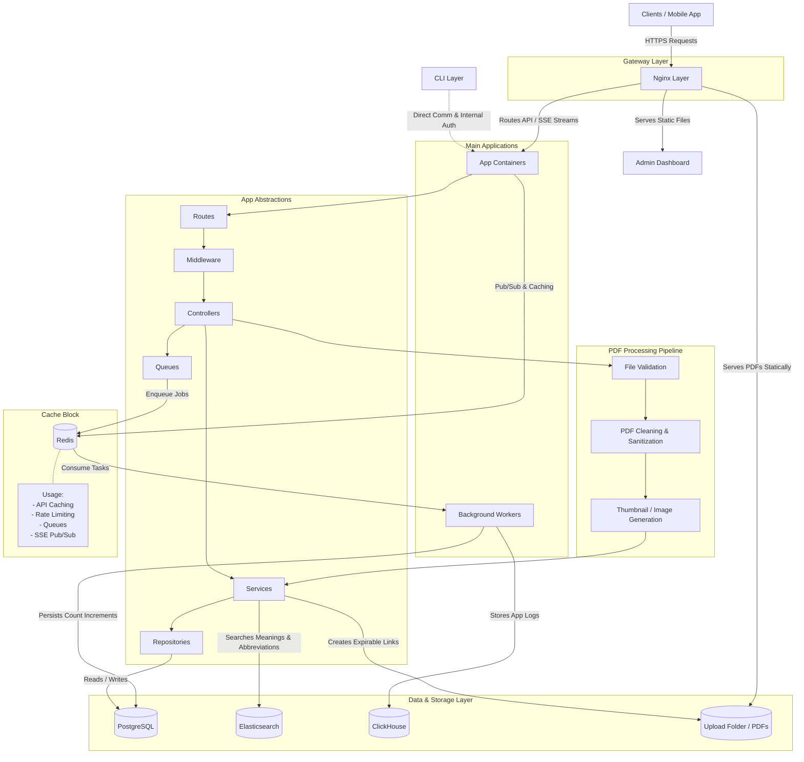

# VayuReader

VayuReader is a scalable platform for secure PDF management, content delivery, and administrative control. It is designed to handle both high-performance workloads and security-critical environments through a configurable architecture.

The project includes a backend system, web-based admin dashboard, and a mobile application. It focuses on balancing latency, throughput, and data protection depending on deployment requirements.

---

## Overview

VayuReader has evolved from a branch-based architecture into a configuration-driven system. Earlier implementations separated performance and security concerns into different branches. This approach has now been replaced with a unified system where features can be selectively enabled or disabled.

---

## Version History

### 1.1.0 (Encrypted Implementation)

Version 1.1.0 represents the fully security-focused implementation of the platform.

Key characteristics:

* End-to-End Encryption using AES-GCM with session-based key generation
* Request-level signing to prevent replay attacks and in-flight tampering
* Strict validation of incoming data before persistence
* PDF file inspection including MIME checks and hash verification
* Frontend parsing of structured inputs (JSON/CSV) into sanitized payloads
* Backend verification to ensure no malicious content is stored
* MongoDB as the primary database and elasticsearch for words and abbreviation search
* Reduced reliance on caching due to encryption overhead

Trade-offs:

* Increased CPU usage due to encryption and validation
* Higher latency compared to non-encrypted deployments
* Limited scalability under heavy workloads without additional optimization

This version is suitable for environments where data security is the primary concern.

---

### 2.0.0 (Configurable Architecture and Performance Improvements)

Version 2.0.0 introduces a major architectural upgrade focused on flexibility, performance, and extensibility.

Key improvements:

* Configuration-based feature control:

  * End-to-End Encryption (enable/disable)
  * DPoP (enable/disable)
  * Request signatures (enable/disable)

* Database enhancements:

  * Support for PostgreSQL as a primary relational database
  * Integration capability with ClickHouse for analytics (OLAP workloads)
  * More scalable data handling compared to MongoDB-only design

* Secure and optimized PDF access:

  * Signature-based access control for PDF resources
  * Expiration-based (time-bound) PDF access
  * Reduced need for repeated validation cycles
  * Significant improvement in response time for protected content delivery

* Performance optimizations:

  * Reduced latency (approximately half compared to 1.1.0 in secure mode)
  * Better utilization of caching when encryption is disabled
  * Improved request handling and throughput

* Improved system design:

  * Transition from branch-based to feature-flag/config-driven architecture
  * Easier deployment customization based on use case
  * Foundation for future scalability features such as batching, CDN integration, and read replicas

Trade-offs:

* Security guarantees depend on configuration
* Additional complexity in managing feature combinations

This version is recommended for most deployments as it provides a balance between performance and security while introducing significant architectural improvements.

---

## Current Architecture

The backend infrastructure is built on a scalable, modular architecture incorporating several specialized layers for routing, caching, background processing, and storage. Below is the High-Level Design (HLD) illustrating these interactions:

### System Components

* **Nginx Layer**: Serves as the reverse proxy and load balancer. It handles routing to appropriate endpoints, serves the React-based admin dashboard seamlessly, serves the expirable PDF files as static assets directly from storage, and channels SSE (Server-Sent Events) to the API containers.
* **App Containers**: Dedicated application servers handling core API orchestration. Responsible for processing frontend requests, interacting with data layers via caches, generating expirable links for secure PDF sharing, and broadcasting real-time SSE updates.
* **Cache Block (Redis)**: A centralized tier optimizing app flow. It manages API caching to lower DB lookup latencies, maintains rate limiting controls against abuse, processes the Pub/Sub logic for SSE, and behaves as the standard queue for assigning tasks to workers.
* **Elasticsearch**: Tailored explicitly for lighting-fast context-aware searches, particularly searching for word meanings and abbreviations.
* **Workers**: Background processor modules designed to cleanly offload asynchronous tasks from the API layer. Key operations include pushing aggregate event logging to ClickHouse and managing delayed/sequential view-count increments onto Postgres reliably.
* **PostgreSQL**: The normal, primary relational database. Source of truth for app objects, user configurations, and content metadata.
* **ClickHouse**: Dedicated OLAP time-series datastore tuned for logging analytics.
* **Upload Folder Storage**: Secure volume used for persistent storage of PDFs. The backend dynamically creates time-bound, expirable URLs, and the valid requests are securely resolved by Nginx, which serves the raw files directly from this volume as static assets.
* **CLI Layer**: Companion terminal application that bypasses the Nginx HTTPS layer. It handles its own authentication natively and communicates directly with internal components for administrative system operations.

---

## Security Model

Depending on configuration, VayuReader provides:

* End-to-End encrypted communication
* Request signing for integrity and replay protection
* Signature-based and expiration-based access control for PDFs
* Payload validation and sanitization
* Secure file handling and verification

Important notes:

* Frontend validation is not a security boundary
* All critical validation is enforced at the backend
* TLS-only deployments rely on standard HTTPS guarantees and are less secure than E2E mode

---

## Performance Model

When security features are minimized:

* Nginx caching improves response time
* Reduced CPU overhead increases throughput
* Signature + expiration-based access reduces repeated processing
* Suitable for large-scale public deployments

---

## Setup

1. Follow the instructions from bakendstartup.md
2. Follow the instructions from frontendstartup.md

Configuration is managed through environment variables.

---

## Contribution

Contributions are welcome, especially in the following areas:

* Backend scalability and performance improvements
* Security enhancements and threat modeling
* UI and usability improvements
* Documentation updates

---

## Notes

* Version 1.1.0 focuses on strict security with encryption-heavy design
* Version 2.0.0 introduces database flexibility, configurable security, and optimized PDF access mechanisms
* The system has transitioned into a more scalable and maintainable architecture

---
