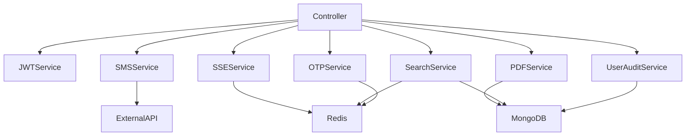

# Services Documentation

Complete reference for all service modules in VayuReader Backend v2.

## Overview

Services encapsulate business logic and are used by controllers. They are pure functions/classes that don't depend on Express, making them easily testable.

**Location**: `src/services/`

---

## JWT Service

**File**: `src/services/jwt.service.js`

### Purpose
Sign and verify JSON Web Tokens for users and admins.

### Functions

#### `generateLifetimeUserToken(userId, payload)`

Generate a lifetime JWT token for users (100-year expiration).

**Parameters**:
- `userId` (ObjectId) - User's MongoDB ID
- `payload` (Object) - Additional data (`phone_number`, `deviceId`, `name`)

**Returns**: JWT string

**Example**:
```javascript
const token = generateLifetimeUserToken(user._id, {
  phone_number: user.phone_number,
  deviceId: 'device-123',
  name: user.name
});
```

**Token Payload**:
```javascript
{
  userId: "507f1f77bcf86cd799439011",
  phone_number: "+1234567890",
  deviceId: "device-123",
  name: "John Doe",
  type: "user",
  iat: 1704902400,
  exp: 4860902400  // 100 years later
}
```

#### `generateAdminToken(admin)`

Generate a session JWT token for admins (1-day expiration).

**Parameters**:
- `admin` (Object) - Admin document

**Returns**: JWT string

**Example**:
```javascript
const token = generateAdminToken(admin);
```

**Token Payload**:
```javascript
{
  adminId: "507f1f77bcf86cd799439011",
  contact: "+1234567890",
  name: "Admin User",
  isSuperAdmin: true,
  permissions: ["manage_pdfs", "manage_dictionary", ...],
  type: "admin",
  iat: 1704902400,
  exp: 1704988800  // 1 day later
}
```

#### `verifyToken(token)`

Verify and decode a JWT token.

**Parameters**:
- `token` (String) - JWT string

**Returns**: Decoded payload object

**Throws**: Error if token is invalid or expired

**Example**:
```javascript
try {
  const decoded = verifyToken(token);
  console.log(decoded.userId);
} catch (error) {
  console.error('Invalid token');
}
```

---

## OTP Service

**File**: `src/services/otp.service.js`

### Purpose
Generate, encrypt, store, and verify OTPs using Redis.

### Functions

#### `generateOtp()`

Generate a random 6-digit OTP.

**Returns**: String (6 digits)

**Example**:
```javascript
const otp = generateOtp();  // "123456"
```

#### `saveOtp(phone_number, otp, deviceId)`

Encrypt OTP with deviceId and store in Redis.

**Parameters**:
- `phone_number` (String) - User's phone number
- `otp` (String) - 6-digit OTP
- `deviceId` (String) - Device identifier

**Returns**: Promise<void>

**Example**:
```javascript
await saveOtp('+1234567890', '123456', 'device-123');
```

**Redis Key**: `otp:+1234567890`  
**TTL**: 5 minutes (300 seconds)

#### `verifyOtp(otp, phone_number, deviceId)`

Verify OTP by decrypting with deviceId.

**Parameters**:
- `otp` (String) - Submitted OTP
- `phone_number` (String) - User's phone number
- `deviceId` (String) - Device identifier

**Returns**: Promise<Object>
```javascript
{
  valid: true|false,
  error: "Error message" // if invalid
}
```

**Example**:
```javascript
const result = await verifyOtp('123456', '+1234567890', 'device-123');
if (result.valid) {
  // OTP is correct
} else {
  console.error(result.error);
}
```

#### `deleteOtp(phone_number)`

Delete OTP from Redis after successful verification.

**Parameters**:
- `phone_number` (String)

**Returns**: Promise<void>

**Example**:
```javascript
await deleteOtp('+1234567890');
```

#### `shouldSkipSend()`

Check if SMS sending should be skipped (dev mode).

**Returns**: Boolean

**Example**:
```javascript
if (shouldSkipSend()) {
  console.log('Dev mode: OTP not sent via SMS');
}
```

---

## SMS Service

**File**: `src/services/sms.service.js`

### Purpose
Send OTPs via external SMS gateway.

### Functions

#### `sendOtpSms(phone_number, otp)`

Send OTP via SMS gateway (async, fire-and-forget).

**Parameters**:
- `phone_number` (String)
- `otp` (String)

**Returns**: Promise<void>

**Example**:
```javascript
sendOtpSms('+1234567890', '123456').catch(err => {
  console.error('SMS failed:', err);
});
```

**Gateway Configuration**:
```javascript
const gatewayUrl = process.env.OTP_GATEWAY_URL;
const message = `Your OTP is: ${otp}`;

await axios.post(gatewayUrl, {
  to: phone_number,
  message
});
```

---

## User Audit Service

**File**: `src/services/userAudit.service.js`

### Purpose
Log user activities (login, device change, PDF reads).

### Functions

#### `logLogin(user, deviceId)`

Log successful user login.

**Parameters**:
- `user` (Object) - User document
- `deviceId` (String)

**Returns**: Promise<void>

**Example**:
```javascript
await logLogin(user, 'device-123');
```

**Creates**:
```javascript
{
  userId: user._id,
  phone_number: user.phone_number,
  action: 'LOGIN',
  deviceId: 'device-123',
  metadata: {
    ip: req.ip,
    userAgent: req.headers['user-agent']
  },
  timestamp: new Date()
}
```

#### `logDeviceChange(user, oldDeviceId, newDeviceId)`

Log device change event.

**Parameters**:
- `user` (Object)
- `oldDeviceId` (String)
- `newDeviceId` (String)

**Returns**: Promise<void>

**Example**:
```javascript
await logDeviceChange(user, 'old-device', 'new-device');
```

#### `logPdfRead(user, pdf)`

Log PDF view event.

**Parameters**:
- `user` (Object)
- `pdf` (Object) - PDF document

**Returns**: Promise<void>

**Example**:
```javascript
await logPdfRead(user, pdf);
```

---

## Search Service

**File**: `src/services/search.service.js`

### Purpose
Centralized search logic with Redis caching.

### Functions

#### `searchDictionary(term, options)`

Search dictionary words with caching.

**Parameters**:
- `term` (String) - Search term
- `options` (Object) - `{ page, limit }`

**Returns**: Promise<Object>
```javascript
{
  results: [Word],
  pagination: { ... }
}
```

**Caching**: 60 seconds TTL

**Example**:
```javascript
const results = await searchDictionary('example', { page: 1, limit: 20 });
```

#### `searchAbbreviation(term, options)`

Search abbreviations with caching.

**Parameters**:
- `term` (String)
- `options` (Object)

**Returns**: Promise<Object>

**Example**:
```javascript
const results = await searchAbbreviation('API', { page: 1, limit: 20 });
```

---

## SSE Service

**File**: `src/services/sse.service.js`

### Purpose
Publish/subscribe events via Redis Pub/Sub for Server-Sent Events.

### Functions

#### `publishEvent(channel, data)`

Publish event to Redis channel.

**Parameters**:
- `channel` (String) - Channel name (`pdf.events`, `audit.events`)
- `data` (Object) - Event data

**Returns**: Promise<void>

**Example**:
```javascript
await publishEvent('pdf.events', {
  type: 'PDF_ADDED',
  payload: {
    pdfId: pdf._id,
    title: pdf.title,
    uploadedBy: admin.name
  }
});
```

#### `subscribe(channel, callback)`

Subscribe to Redis channel.

**Parameters**:
- `channel` (String)
- `callback` (Function) - Called with `(message)` on each event

**Returns**: Promise<void>

**Example**:
```javascript
await subscribe('pdf.events', (message) => {
  const event = JSON.parse(message);
  console.log('Event:', event.type);
});
```

#### `closeConnection(clientId)`

Close SSE connection for a client.

**Parameters**:
- `clientId` (String)

**Returns**: void

---

## PDF Service

**File**: `src/services/pdf.service.js`

### Purpose
Handle PDF file operations (upload, delete, metadata).

### Functions

#### `uploadPdf(file, metadata, admin)`

Process PDF upload.

**Parameters**:
- `file` (Object) - Multer file object
- `metadata` (Object) - `{ title, description, category }`
- `admin` (Object) - Admin document

**Returns**: Promise<PdfDocument>

**Example**:
```javascript
const pdf = await uploadPdf(req.files.pdf[0], {
  title: 'Document Title',
  description: 'Description',
  category: 'Technical'
}, admin);
```

#### `deletePdf(pdfId)`

Delete PDF and associated files.

**Parameters**:
- `pdfId` (ObjectId)

**Returns**: Promise<void>

**Example**:
```javascript
await deletePdf('507f1f77bcf86cd799439011');
```

---

## Common Patterns

### Error Handling

```javascript
const someService = async (param) => {
  try {
    // Service logic
    return result;
  } catch (error) {
    console.error('[Service] Error:', error);
    throw error;  // Re-throw for controller to handle
  }
};
```

### Caching Pattern

```javascript
const searchWithCache = async (term) => {
  const cacheKey = `search:${term}`;
  
  // Check cache
  const cached = await redisClient.get(cacheKey);
  if (cached) {
    return JSON.parse(cached);
  }
  
  // Query database
  const results = await Model.find({ /* query */ });
  
  // Cache results
  await redisClient.setEx(cacheKey, 60, JSON.stringify(results));
  
  return results;
};
```

### Async Fire-and-Forget

```javascript
const notifyUser = async (userId, message) => {
  sendNotification(userId, message).catch(err => {
    console.error('Notification failed:', err);
    // Don't throw - this is non-critical
  });
};
```

---

## Testing Services

### Unit Test Example

```javascript
const { generateOtp, saveOtp, verifyOtp } = require('../services/otp.service');

describe('OTP Service', () => {
  it('should generate 6-digit OTP', () => {
    const otp = generateOtp();
    expect(otp).toMatch(/^\d{6}$/);
  });
  
  it('should save and verify OTP', async () => {
    const otp = '123456';
    await saveOtp('+1234567890', otp, 'device-123');
    
    const result = await verifyOtp(otp, '+1234567890', 'device-123');
    expect(result.valid).toBe(true);
  });
  
  it('should reject wrong device ID', async () => {
    const otp = '123456';
    await saveOtp('+1234567890', otp, 'device-123');
    
    const result = await verifyOtp(otp, '+1234567890', 'wrong-device');
    expect(result.valid).toBe(false);
  });
});
```

---

## Service Dependencies



---

## Best Practices

1. **Keep services pure** - No Express dependencies
2. **Single responsibility** - One service, one concern
3. **Error handling** - Always catch and log errors
4. **Async/await** - Use modern async patterns
5. **Testability** - Easy to unit test in isolation
6. **Documentation** - JSDoc comments for all functions
7. **Logging** - Log important operations
8. **Caching** - Use Redis for expensive operations
