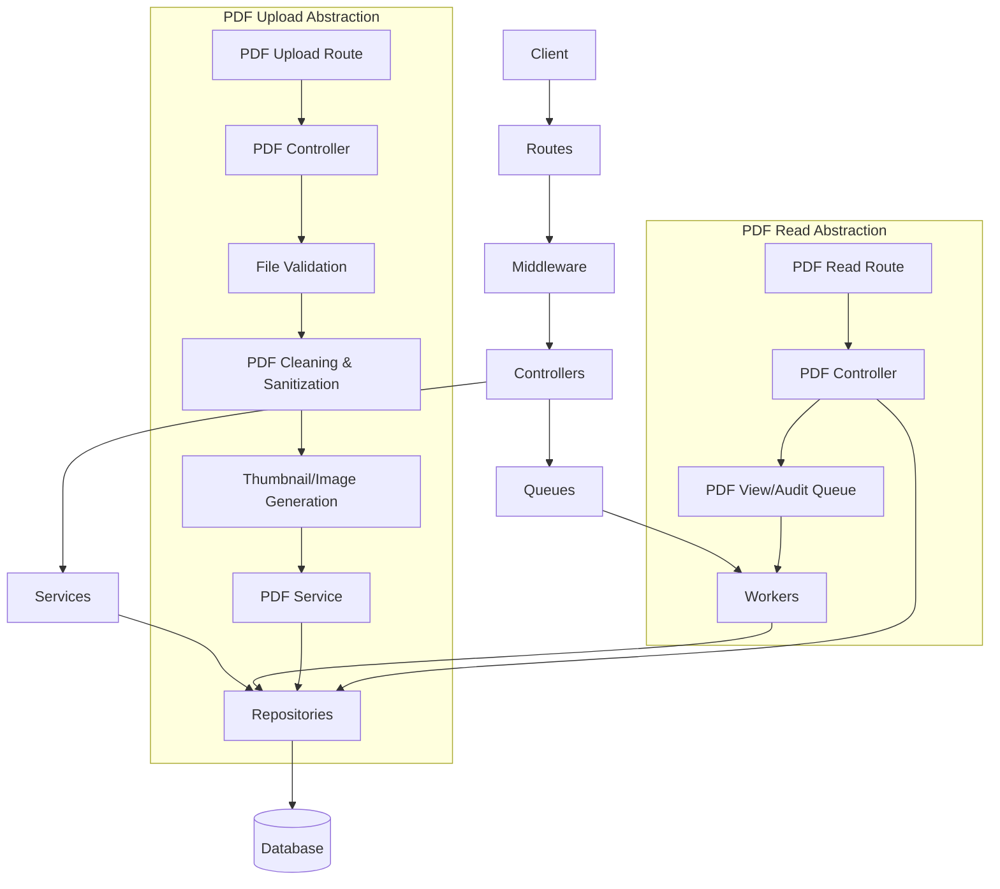

# VayuReader Backend v2

Secure, scalable, and containerized backend for VayuReader.

## 🚀 Quick Start (Docker)

The easiest way to run the backend, database, and cache is using Docker.

### 1. Prerequisites
- Docker Desktop installed
- OpenSSL (for generating local certs)

### 2. Generate SSL Certificates
Since you have Docker, you can generate certificates without installing OpenSSL on your machine:

**PowerShell (Windows):**
```powershell
docker run --rm -v "${PWD}/nginx/certs:/certs" alpine /bin/sh -c "apk add --no-cache openssl && openssl req -x509 -nodes -days 365 -newkey rsa:2048 -keyout /certs/server.key -out /certs/server.crt -subj '/C=US/ST=State/L=City/O=Organization/CN=localhost'"
```

**Git Bash / Mac / Linux:**
```bash
docker run --rm -v "$(pwd)/nginx/certs:/certs" alpine /bin/sh -c "apk add --no-cache openssl && openssl req -x509 -nodes -days 365 -newkey rsa:2048 -keyout /certs/server.key -out /certs/server.crt -subj '/C=US/ST=State/L=City/O=Organization/CN=localhost'"
```

### 3. Start Application
```bash
docker-compose up --build
```
- **Backend API**: `https://localhost/api`
- **Health Check**: `https://localhost/health`

---

## 🛠 Manual Setup (Local Development)

If you prefer to run Node.js locally without Docker:

### 1. Install Dependencies
```bash
npm install
```

### 2. Environment Setup
Copy `.env.example` to `.env` and fill in:
```env
MONGODB_URI=mongodb://localhost:27017/vayureader
REDIS_URL=redis://localhost:6379
JWT_SECRET=your_super_secret_key_at_least_32_chars
OTP_GATEWAY_URL=http://localhost:8000/smsc/sends
```

### 3. Run SMS Simulator (Optional)
To test OTPs without a real SMS gateway:
```bash
node scripts/sms-simulator.js
```
- **UI**: http://localhost:8000
- **Gateway**: http://localhost:8000/smsc/sends

### 4. Create Super Admin
To access the admin panel, you need a super admin account.

**Running with Docker:**
```bash
# Run this while containers are up
docker-compose exec app node scripts/seedAdmin.js "Admin User" "9999999999" "StrongPassword123"
```

**Running Locally:**
```bash
node scripts/seedAdmin.js "Admin User" "9999999999" "StrongPassword123"
```

### 5. Start Server
```bash
npm run dev
```

---

## 🔒 Security Features (Implemented)
- **Authentication**: JWT in HTTP-Only, Secure, SameSite cookies.
- **2FA**: OTP-based login for admins and users.
- **Encryption**: HTTPS enforcement via Nginx + HSTS.
- **Input Validation**: `express-mongo-sanitize` (NoSQL Injection) + Regex escaping (ReDoS).
- **Headers**: Helmet security headers.
- **Rate Limiting**: Redis-based rate limiting per IP.

## 🐳 Docker Stack
- **App**: Node.js 20 (Alpine)
- **Gateway**: Nginx (Reverse Proxy + SSL)
- **Database**: MongoDB 6
- **Cache**: Redis 7
.0

Secure, well-structured backend API for VayuReader application.

## Quick Start

```bash
# 1. Install dependencies
npm install

# 2. Set up environment
cp .env.example .env
# Edit .env with your values

# 3. Start server
npm run dev
```

## Architecture



```
src/
├── cli/              # Admin/ops utilities (e.g., cleanup, scripts)
├── config/           # Environment, database, CORS configuration
├── controllers/      # Request handlers (thin orchestration layer)
├── db/               # DB migrations and database helpers
├── middleware/       # Auth, rate limiting, validation, encryption, error handling
├── models/           # Schemas/entities (User, Admin, PDF, Word, Abbreviation)
├── queues/           # Queue provider + logical queue routes
├── repositories/     # Data access layer (e.g., Postgres/Mongo)
├── routes/           # HTTP routing (maps endpoints -> controllers)
├── services/         # Business logic (JWT, OTP, SMS, Audit, Thumbnails)
├── utils/            # Helpers (sanitize, response, file validation, PDF tools)
├── workers/          # Background consumers (audit, pdf views, etc.)
├── cluster.js        # Process clustering/bootstrap
└── server.js         # Main entry point
```

## API Endpoints

| Endpoint | Description |
|----------|-------------|
| `POST /api/auth/login/request-otp` | Request OTP for user login |
| `POST /api/auth/login/verify-otp` | Verify OTP and get token |
| `POST /api/admin/login/request-otp` | Request OTP for admin login |
| `POST /api/admin/login/verify-otp` | Verify admin OTP and get token |
| `GET /api/pdfs` | Search PDFs |
| `POST /api/pdfs/upload` | Upload PDF (admin) |
| `GET /api/dictionary/word/:word` | Look up word |
| `GET /api/abbreviations/:abbr` | Look up abbreviation |
| `GET /api/audit/logs` | View audit logs (admin) |

## Security Features

- ✅ Rate limiting on all endpoints
- ✅ OTP-based authentication for both users and admins
- ✅ Role-based access control (RBAC)
- ✅ Input sanitization (ReDoS prevention)
- ✅ Whitelist-based CORS
- ✅ Fail-fast on missing secrets
- ✅ Secure file upload with type validation
- ✅ Multi-layer PDF protection (deep scan + sanitization rewrite)
- ✅ Audit logging for all admin actions

## Environment Variables

See `.env.example` for full list. Required:

- `MONGODB_URI` - MongoDB connection string
- `JWT_SECRET` - Secret for JWT signing (min 32 chars)
- `OTP_GATEWAY_URL` - SMS gateway URL (msg.com compatible)

## Initial Admin Setup

Create first admin directly in MongoDB:

```javascript
db.admins.insertOne({
  name: "Admin Name",
  contact: "1234567890",
  isSuperAdmin: true,
  permissions: [],
  createdAt: new Date(),
  updatedAt: new Date()
})
```

## License

PRIVATE - IAF
